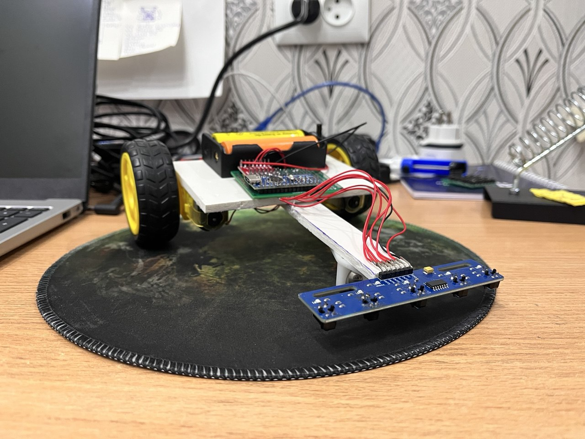
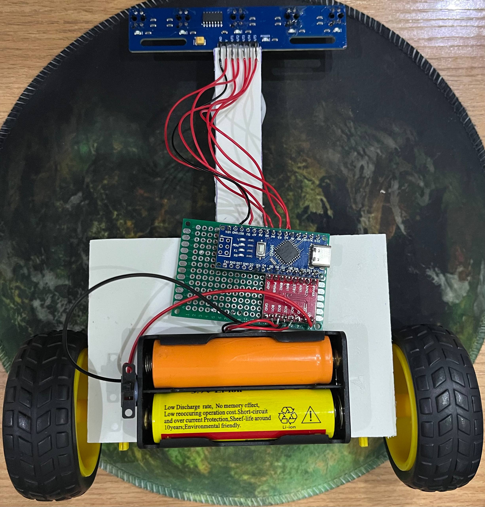
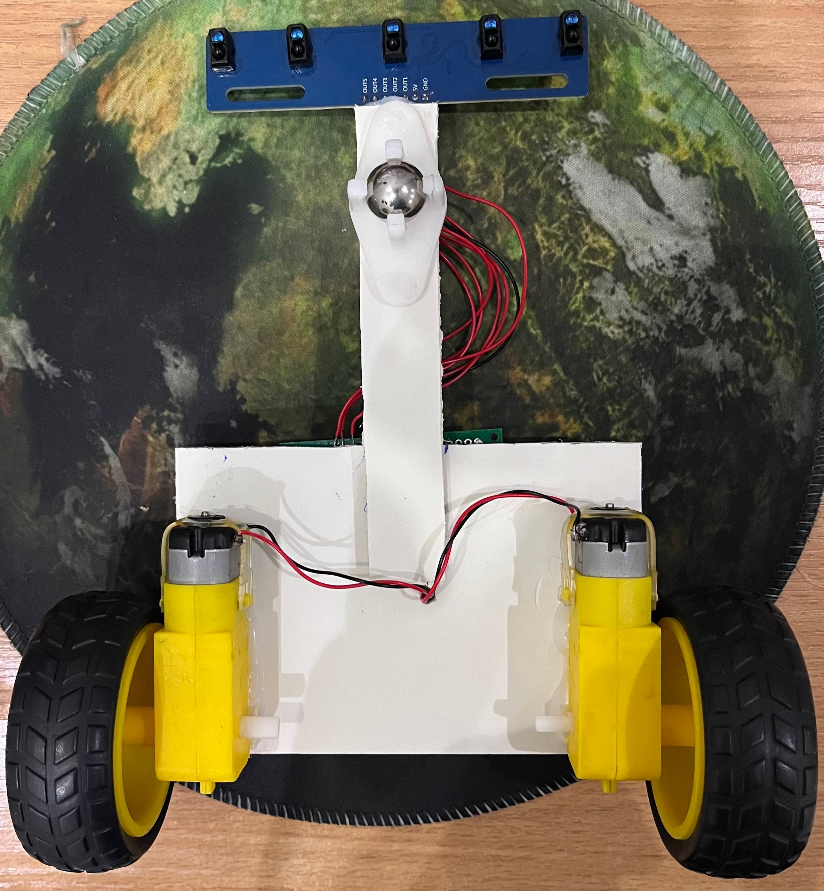
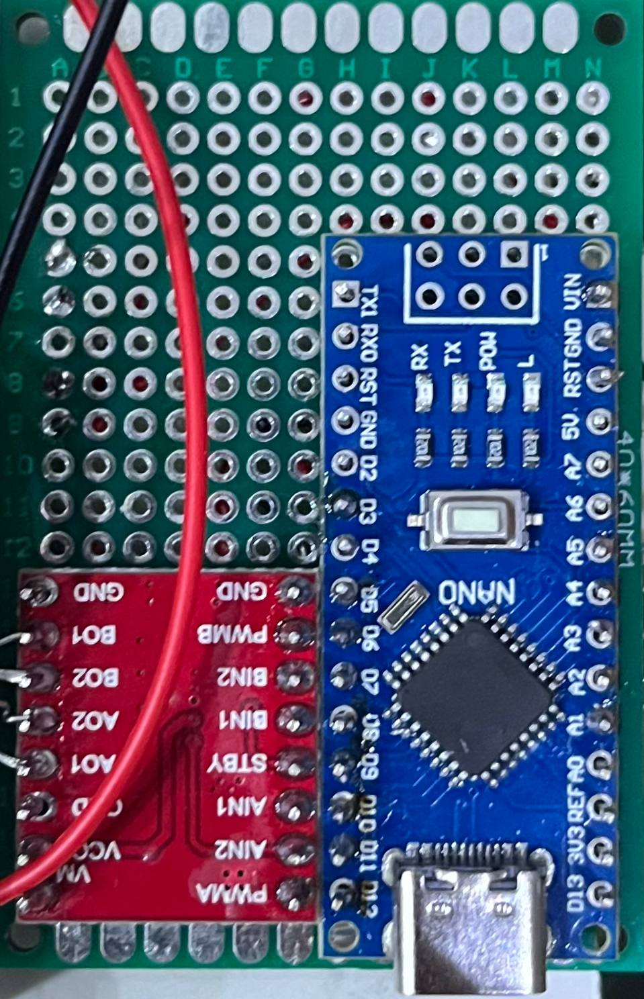
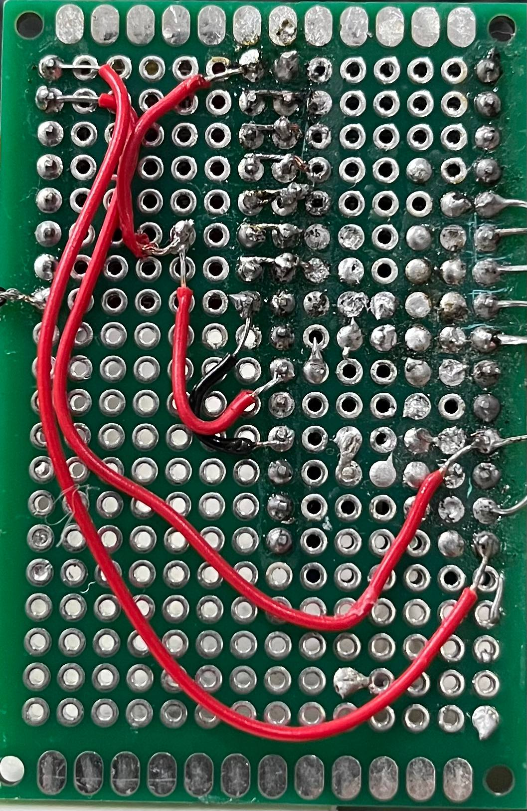
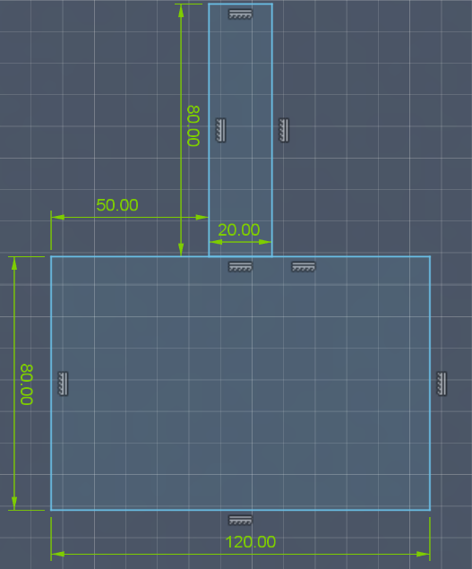

# Line follower

This line follower uses 5 channel line sensor but 4 of them are used (sensor in the middle is skipped). I tried to make it smaller, so used small arduino board and motor driver

## Images

### Line follower
| Up view | Bottom view |
| --- | --- |
|  |  |

### PCB
| Up view | Bottom view |
| --- | --- |
|  |  |

## BOM
| Component              | Quantity | Link                      |
|------------------------|----------|---------------------------|
| Arduino Nano           | 1        | https://ali.click/z2x131e |
| TB6612FNG Motor Driver | 1        | https://ali.click/75x131s |
| 5 Channel Line Sensor  | 1        | https://ali.click/6ax131j |
| TT Motor with wheel    | 2        | https://ali.click/ghx1310 |
| Li-ion 18650 batteries | 2        | https://ali.click/lxx131w |
| Battery case           | 1        | https://ali.click/i3y131d |
| 40x60mm PCB            | 1        | https://ali.click/kuy131o |
| Vacuum steel ball      | 1        | https://ali.click/l7z131e |
| Switch                 | 1        | https://ali.click/gwy1312 |

## Dimensions

### Note
All dimensions are given in mm

## Schematics
I couldnt find the right software to display schematic as image, so I used table instead
| Arduino | TB6612FNG |
|---------|-----------|
| D3      | PWMA      |
| D11     | AIN2      |
| D10     | AIN1      |
| D9      | STBY      |
| D8      | BIN1      |
| D7      | BIN2      |
| D6      | PWMB      |
| VIN     | VM        |
| 5V      | VCC       |
| GND     | GND       |

| Arduino | 5-channel line sensor |
|---------|-----------------------|
| A1      | OUT5                  |
| A2      | OUT4                  |
| A4      | OUT2                  |
| A5      | OUT1                  |
| 5V      | 5V                    |
| GND     | GND                   |

| Motors                  | TB6612FNG |
|-------------------------|-----------|
| Right motor's right pin | AO1       |
| Right motor's left pin  | A02       |
| Left motor's right pin  | BO2       |
| Left motor's left pin   | BO1       |

| Batteries | TB6612FNG |
|-----------|-----------|
| +         | VM        |
| -         | GND       |

### Notes
- Don't use more than two batteries because Arduino Nano can't handle so much current
- Add a switch to battery set for turn on/off
- Make sure Arduino Nano's and TB6612FNG's GND pins are wired to each other

